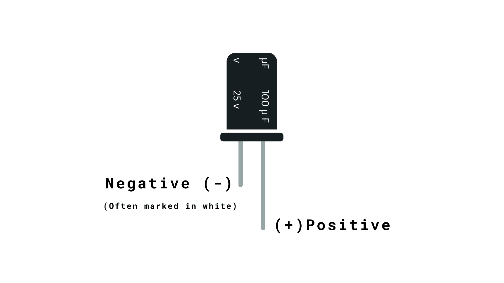

### **Experiment 11**
> *Interfacing Servo Motor with the Arduino with a Potentiometer*

---
---

### **Aim of the experiment:**
> A program to control the position of a servo motor using Arduino and a potentiometer.


---

### **Components Required:**
- Arduino Board
- Servo Motor
- 10k ohm potentiometer
- Hook-up wires
- Capacitors
- Power supply


---

### **Diagram -**

1. Capacitor
<p align="center">

</p>
2. Knob
<p align="center">
</p>
3. Sweep

<p align="center">
</p>

---

### **Arduino Code:**
#### **1. Knob**
Controlling a servo position using a potentiometer (variable resistor).
```ino

#include <Servo.h>
Servo myservo;  // create servo object to control a servo
int potpin = 0;  // analog pin used to connect the potentiometer
int val;    // variable to read the value from the analog pin
void setup() {
  myservo.attach(9);  // attaches the servo on pin 9 to the servo object
}
void loop() {
  val = analogRead(potpin);            // reads the value of the potentiometer (value between 0 and 1023)
  val = map(val, 0, 1023, 0, 180);     // scale it to use it with the servo (value between 0 and 180)
  myservo.write(val);                  // sets the servo position according to the scaled value
  delay(15);                           // waits for the servo to get there
}
```
#### **2. Sweep**
> Sweeps the shaft of a RC servo motor back and forth across 180 degrees.
```ino
#include <Servo.h>
Servo myservo;  // create servo object to control a servo
// twelve servo objects can be created on most boards
int pos = 0;    // variable to store the servo position
void setup() {
  myservo.attach(9);  // attaches the servo on pin 9 to the servo object
}
void loop() {
  for (pos = 0; pos <= 180; pos += 1) { // goes from 0 degrees to 180 degrees
    // in steps of 1 degree
    myservo.write(pos);              // tell servo to go to position in variable 'pos'
    delay(15);                       // waits 15ms for the servo to reach the position
  }
  for (pos = 180; pos >= 0; pos -= 1) { // goes from 180 degrees to 0 degrees
    myservo.write(pos);              // tell servo to go to position in variable 'pos'
    delay(15);                       // waits 15ms for the servo to reach the position
  }
}
``` 
---
### **Conclusion**
> The experiment successfully controlled the position of a servo motor using Arduino, demonstrating precise angle adjustments.

---

<div style="display: flex; justify-content: space-between; align-items: center; margin: 20px 0; position: relative;">
    <div style="text-align: left;">
        <a href="10.md" style="background: #333; color: white; padding: 8px 16px; border-radius: 20px; text-decoration: none; font-weight: bold;">⏮</a>
    </div>
    <div style="position: absolute; left: 50%; transform: translateX(-50%);">
        <a href="../" style="background: #333; color: white; padding: 8px 12px; border-radius: 20px; text-decoration: none; font-weight: bold; display:inline-flex; align-items:center; justify-content:center;">
            <svg viewBox="0 0 24 24" width="20" height="20" aria-hidden="true" preserveAspectRatio="xMidYMid meet">
                <path d="M3 11.5L12 4l9 7.5" stroke="#FFFFFF" stroke-width="1.6" stroke-linecap="round" stroke-linejoin="round" fill="none" />
                <path d="M9 21V12h6v9" stroke="#FFFFFF" stroke-width="1.6" stroke-linecap="round" stroke-linejoin="round" fill="none" />
            </svg>
        </a>
    </div>
    <div style="text-align: right;">
        <a href="12.md" style="background: #333; color: white; padding: 8px 16px; border-radius: 20px; text-decoration: none; font-weight: bold;">⏭</a>
    </div>
    </div>
</div>