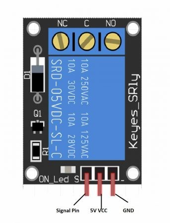
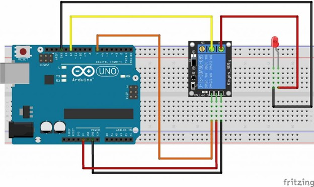

## **Experiment 13**
> *Interfacing of the Relay with Arduino*

---
---

### **Aim of the experiment**
> A program to control high voltage AC cuurent using a relay module with Arduino .

---

### **Components Required**
- Arduino Uno
- LED
- 5V Relay Module
- Bread Board
- Jumper Wires


---

### **Diagram -**
<p align="center"></p>
<p align="center"></p>

---

#### **Relay Terminal Functions**

| Terminal Label | Function Description |
| :--- | :--- |
| **C (Common)** | The central moving contact that switches between NO and NC. | 
| **NO (Normally Open)** | The "open" or off contact. | 
| **NC (Normally Closed)** | The "closed" or on contact. | **Connected** to Common (C). | 
| **GND** | Ground connection for the circuit. | 
| **Signal** | Control signal to activate (energize) the relay. | 

#### **Wiring Connections**
| Module / Pin | Connected to |
|---|---|
| GND pin of 5V Relay | GND pin of Arduino |
| Signal (Input) pin of 5V Relay | Digital pin 7 of Arduino |
| VCC pin of 5V Relay | 5V pin of Arduino |
| Common (COM) pin of 5V Relay | Digital pin 12 of Arduino |
| NO (Normally Open) pin of 5V Relay | Positive (anode) pin of the LED |
| GND pin of LED | GND pin of Arduino |


#### **Arduino Code -**
```ino
int relay_pin = 7;
int led_pin = 12;
void setup()
{ 
  pinMode(relay_pin,OUTPUT);
  pinMode(led_pin,OUTPUT);  
  digitalWrite(led_pin,HIGH);
}
void loop()
{
  digitalWrite(relay_pin,HIGH);
  delay(2000);
  digitalWrite(relay_pin,LOW);
  delay(2000);
}
```

---

### **Conclusion**
> The experiment successfully demonstrated how to interface a relay module with an Arduino to control high voltage devices.

---

<div style="display: flex; justify-content: space-between; align-items: center; margin: 20px 0; position: relative;">
    <div style="text-align: left;">
        <a href="12.md" style="background: #333; color: white; padding: 8px 16px; border-radius: 20px; text-decoration: none; font-weight: bold;">⏮</a>
    </div>
    <div style="position: absolute; left: 50%; transform: translateX(-50%);">
        <a href="../" style="background: #333; color: white; padding: 8px 12px; border-radius: 20px; text-decoration: none; font-weight: bold; display:inline-flex; align-items:center; justify-content:center;">
            <svg viewBox="0 0 24 24" width="20" height="20" aria-hidden="true" preserveAspectRatio="xMidYMid meet">
                <path d="M3 11.5L12 4l9 7.5" stroke="#FFFFFF" stroke-width="1.6" stroke-linecap="round" stroke-linejoin="round" fill="none" />
                <path d="M9 21V12h6v9" stroke="#FFFFFF" stroke-width="1.6" stroke-linecap="round" stroke-linejoin="round" fill="none" />
            </svg>
        </a>
    </div>
    <div style="text-align: right;">
        <a href="14.md" style="background: #333; color: white; padding: 8px 16px; border-radius: 20px; text-decoration: none; font-weight: bold;">⏭</a>
    </div>
    </div>
</div>